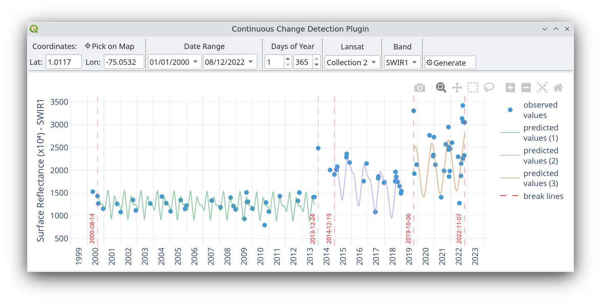

# CCD-Plugin

The CCD-Plugin utilizes PyCCD and data from Google Earth Engine to implement the Continuous Change Detection algorithm to analyze the trend and breakpoints of change over multi-year time series at a given coordinate.

The plugin uses Google Earth Engine to retrieve data for the specified coordinates for all available Landsat satellites, including 4, 5, 7, 8, and 9, from Collections 1 or 2. It filters for high-quality data only. The plugin then uses [PyCCD](https://code.usgs.gov/lcmap/pyccd) to calculate the trend and breakpoints using the Continuous Change Detection algorithm.

- Zhu, Z., & Woodcock, C. E. (2014). Continuous change detection and classification of land cover using all available Landsat data. Remote sensing of Environment, 144, 152-171. https://doi.org/10.1016/j.rse.2014.01.011

- Arévalo, P., Bullock, E.L., Woodcock, C.E., Olofsson, P., (2020). A Suite of Tools for Continuous Land Change Monitoring in Google Earth Engine. Front. Clim. 2. https://doi.org/10.3389/fclim.2020.576740

## Installation

The plugin needs to work:

- Google Earth Engine [plugin](https://gee-community.github.io/qgis-earthengine-plugin/ ): The user needs to have this plugin installed and an active Google Earth Engine (EE) account.
- PyCCD, numpy, scipy, scikit-learn and ploty. These packages are included in the all-in-one zip prepared by each OS: *CCD_Plugin_Windows.zip*, *CCD_Plugin_Linux.zip* and *CCD_Plugin_MacOS.zip* available in the [releases](https://github.com/SMByC/AcATaMa/releases) section. The user needs to (re)install the plugin from "Install from zip" in Qgis.

## About us

CCD-Plugin was developing, designed and implemented by the Group of Forest and Carbon Monitoring System (SMByC), operated by the Institute of Hydrology, Meteorology and Environmental Studies (IDEAM) - Colombia.

Author and developer: *Xavier C. Llano* *<xavier.corredor.llano@gmail.com>*  
Theoretical support, tester and product verification: SMByC-PDI group

## License

CCD-Plugin is a free/libre software and is licensed under the GNU General Public License.
