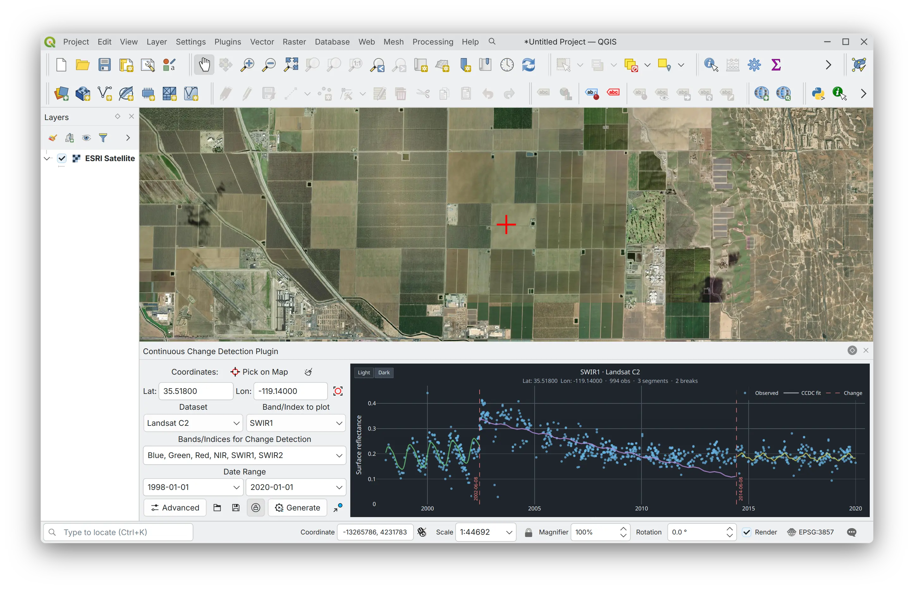

# CCD-Plugin

The CCD-Plugin uses Google Earth Engine to get Landsat or Sentinel2 datasets and run the Continuous Change Detection 
(CCDC) algorithm to analyze the trends and breakpoints of change over multi-year time series at a given coordinate.

The plugin uses Google Earth Engine (GEE) to retrieve data for the specified coordinates for all available Landsat 
satellites, including 4, 5, 7, 8, and 9, from Collection 2, or the Harmonized Sentinel-2 collection. It applies a
balanced cloud/shadow/snow mask plus CCDC's temporal TMask, keeping as many clear observations as possible. Then
the plugin runs the Continuous Change Detection algorithm in Google Earth Engine to find temporal breakpoints of
the image collection by iteratively fitting harmonic functions to the data.

### Cloud masking

Landsat always uses the Collection 2 QA bands: CFmask (`QA_PIXEL`) for fill, cloud, dilated cloud, cloud shadow,
snow and — on Landsat 8/9 only — cirrus; `QA_RADSAT` for saturation; and the per-sensor haze product
(`SR_ATMOS_OPACITY` for TM/ETM+, `SR_QA_AEROSOL` for OLI/OLI-2). The cloud *confidence* bits are deliberately
not used, so low and medium confidence clear pixels are kept, and reflectance outside the valid range is dropped.
The Landsat 7 SLC-off scan gaps are fill, so the QA fill bit already removes them.

For Sentinel-2 the mask is selectable in *Advanced settings*:

| Filter | What it uses | When to prefer it |
|---|---|---|
| **Cloud Score+** (default) | `cs_cdf` from `GOOGLE/CLOUD_SCORE_PLUS`, scoring cloud, cirrus, haze and shadow together | Best quality/retention balance; recommended |
| **s2cloudless** | `COPERNICUS/S2_CLOUD_PROBABILITY` plus a solar-geometry shadow projection | Comparison, or to reproduce older results |
| **Sen2Cor** | the L2A scene classification (`SCL`), dilated | When the SCL classes are known to work well for the area |
| **No Mask** | nothing; CCDC's TMask alone screens the series | Very cloudy areas where any mask leaves too few observations |

In every case the masks are per-pixel only — a scene is never dropped because the rest of the tile is cloudy,
since only the pixel at the requested coordinate matters.

### Availability of dataset collections (GEE)

- **Landsat C2** (30m resolution): 1982 → present (dense coverage from 1984)
- **Sentinel-2** (10m resolution): 2017-03 → present (global only from late 2018)

> Landsat Collection 1 was decommissioned by USGS and removed from the GEE data catalog, so it is no longer supported.

### Time series / change detection

The sub-datasets to visualize and compute the CCDC algorithm and its breakpoints are:

- **Bands:** Blue, Green, Red, NIR, SWIR1, SWIR2

- **Indices:** NDVI, NBR, EVI, EVI2, BRIGHTNESS, GREENNESS, WETNESS

### Change detection defaults

| Setting | Default | Why |
|---|---|---|
| Breakpoint bands | Green, Red, NIR, SWIR1, SWIR2 | Blue is excluded: it carries the most residual haze/aerosol signal and is a known source of false breaks. Matches Zhu & Woodcock (2014), gee-ccdc-tools and SEPAL |
| TMask bands | Green, SWIR1 | Cloud is bright in green, shadow and snow dark in SWIR1. Earth Engine requires these to also be breakpoint bands, so they are added automatically if you deselect them |
| Num Obs | 6 | Consecutive observations needed to confirm a change (useful range 4–8) |
| Chi-square | 0.99 | Raise towards 0.999 for fewer, more certain breaks |
| Min Years | 1.33 | Minimum segment length, in years |
| Lambda | 0.002 | The standard CCDC lambda of 20, rescaled for 0–1 surface reflectance |

> **Confirmed breaks vs. changes in progress.** CCDC reports a `changeProb` per segment. A break is
> only *confirmed* once `changeProb` reaches 1, meaning the full `Num Obs` consecutive observations
> exceeded the threshold. When a series ends while a change is still accumulating, CCDC still
> reports a break date but with a fractional probability (e.g. 1/6 ≈ 17%). The plot draws confirmed
> breaks as red dashed lines and unconfirmed ones as fainter orange dotted lines labelled with
> their probability — an orange line is *not* a detected change.

### References

- Zhu, Z., & Woodcock, C. E. (2014). Continuous change detection and classification of land cover using all available Landsat data. Remote sensing of Environment, 144, 152-171. https://doi.org/10.1016/j.rse.2014.01.011

- Arévalo, P., Bullock, E.L., Woodcock, C.E., Olofsson, P., (2020). A Suite of Tools for Continuous Land Change Monitoring in Google Earth Engine. Front. Clim. 2. https://doi.org/10.3389/fclim.2020.576740

- Crist, E.P., & Cicone, R.C. (1984). A physically-based transformation of Thematic Mapper data — the TM Tasseled Cap. IEEE Transactions on Geoscience and Remote Sensing, 22(3), 256-263. *(BRIGHTNESS/GREENNESS/WETNESS for Landsat 4, 5 and 7)*

- Baig, M.H.A., Zhang, L., Shuai, T., & Tong, Q. (2014). Derivation of a tasselled cap transformation based on Landsat 8 at-satellite reflectance. Remote Sensing Letters, 5(5), 423-431. https://doi.org/10.1080/2150704X.2014.915434 *(BRIGHTNESS/GREENNESS/WETNESS for Landsat 8 and 9)*

- Shi, T., & Xu, H. (2019). Derivation of tasseled cap transformation coefficients for Sentinel-2 MSI at-sensor reflectance data. IEEE JSTARS, 12(10), 4038-4048. https://doi.org/10.1109/JSTARS.2019.2938388 *(BRIGHTNESS/GREENNESS/WETNESS for Sentinel-2)*

- Pasquarella, V.J., Brown, C.F., Czerwinski, W., & Rucklidge, W.J. (2023). Comprehensive Quality Assessment of Optical Satellite Imagery Using Weakly Supervised Video Learning. CVPR Workshops, 2124-2134. *(Cloud Score+)*

## Installation

The plugin needs to work:

- **QGIS >= 4.0** with Qt 6 and Qt WebEngine.
- Google Earth Engine [plugin](https://gee-community.github.io/qgis-earthengine-plugin/ ): The user needs to have this plugin installed and an active Google Earth Engine (EE) account.
- Plotly. Most of the Qgis versions have this library inside, otherwise the plugin install it automatically.

Each numeric GitHub release includes `extlibs.zip`, built with the latest compatible dependencies resolved from
`requirements.txt`. If automatic installation is not available, download that asset from the release matching the
plugin version and extract its contents into an `extlibs` directory inside `CCD_Plugin`.

Release packages are built with `qgis-plugin-ci` from a staged `CCD_Plugin/` directory. The stage keeps the tracked
Qt 6 `resources.py` and omits `resources.qrc`, tests, development files, and generated build artifacts so the archive
contains one installable plugin directory without a generated `resources_rc.py` replacement.

Plots are written as self-contained HTML pages with Plotly embedded. They render offline in Qt WebEngine without CDN
or sibling JavaScript assets, and local pages are not allowed to access remote or other local content.

### Known issues

> **Download plot as a png:**
> It is not working inside the plugin, but it works when the plot is opened in a web browser

> **Linux with Wayland:**
> The functionality of open the current plot in a web browser may not work propertly

## About us

CCD-Plugin was developing, designed and implemented by the Group of Forest and Carbon Monitoring System (SMByC), operated by the Institute of Hydrology, Meteorology and Environmental Studies (IDEAM) - Colombia.

Author and developer: *Xavier C. Llano* *<xavier.corredor.llano@gmail.com>*  
Collaborator and co-developer: *Daniel Moraes* *<moraesd90@gmail.com>*  
Theoretical support, tester and product verification: *SMByC-PDI group*  

## License

CCD-Plugin is a free/libre software and is licensed under the GNU General Public License.
