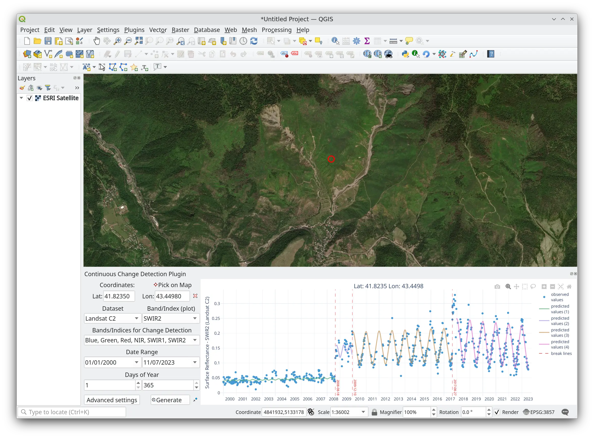

# CCD-Plugin

The CCD-Plugin use Google Earth Engine to get Landsat or Sentinel2 datasets and run the Continuous Change Detection 
(CCDC) algorithm to analyze the trends and breakpoints of change over multi-year time series at a given coordinate.

The plugin uses Google Earth Engine to retrieve data for the specified coordinates for all available Landsat satellites, 
including 4, 5, 7, 8, and 9, from Collections 1 or 2, or Harmonized Sentinel-2 collection. It filters for high-quality 
data only. Then plugin run over Google Earth Engine the Continuous Change Detection algorithm to find temporal 
breakpoints of the image collection by iteratively fitting harmonic functions to the data.

- Zhu, Z., & Woodcock, C. E. (2014). Continuous change detection and classification of land cover using all available Landsat data. Remote sensing of Environment, 144, 152-171. https://doi.org/10.1016/j.rse.2014.01.011

- Arévalo, P., Bullock, E.L., Woodcock, C.E., Olofsson, P., (2020). A Suite of Tools for Continuous Land Change Monitoring in Google Earth Engine. Front. Clim. 2. https://doi.org/10.3389/fclim.2020.576740

## Installation

The plugin needs to work:

- Google Earth Engine [plugin](https://gee-community.github.io/qgis-earthengine-plugin/ ): The user needs to have this plugin installed and an active Google Earth Engine (EE) account.
- Plotly. Most of the Qgis versions have this library inside, otherwise the plugin install it automatically.

## About us

CCD-Plugin was developing, designed and implemented by the Group of Forest and Carbon Monitoring System (SMByC), operated by the Institute of Hydrology, Meteorology and Environmental Studies (IDEAM) - Colombia.

Author and developer: *Xavier C. Llano* *<xavier.corredor.llano@gmail.com>*  
Collaborator and co-developer: *Daniel Moraes* *<moraesd90@gmail.com>*  
Theoretical support, tester and product verification: *SMByC-PDI group*  

## License

CCD-Plugin is a free/libre software and is licensed under the GNU General Public License.
